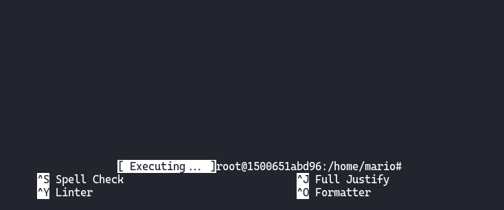

# [Move](https://dockerlabs.es/)

## Despliegue

Primero desplegamos la máquina con ```bash auto_deploy.sh move.tar``` (si no sabes en la página de DockerLabs ahí un pdf que lo explica).


## Reconocimiento

Una vez desplegada comprobamos que tenemos conectividad con ```ping -c 1 172.17.0.2``` 
<br>


<br>
`-c 1` ⮞ solo lo repite una vez<br>
<br>

Ahora vamos con el reconocimiento de nmap ```nmap -p- --open --min-rate 5000 -sS -vvv -n -Pn 172.17.0.2 -oG allPorts``` <br>
`-p-` ⮞ aplicar reconocimiento a todos los puertos <br>
`--open` ⮞ solo a los que estén abiertos <br>
`--min-rate 5000` ⮞ para enviar paquetes más rápido <br> 
`-sS` ⮞ para descubrir puertos de manera silenciosa y rápida <br> 
`-vvv` ⮞ conforme descubre un puerto nos lo muestra por pantalla <br> 
`-n` ⮞ no aplica la resolución DNS (tarda mucho en el caso de que no pongamos dicho parámetro)<br> 
`-Pn` ⮞ ignora si esta activa o no la IP<br> 
`-oG` ⮞ exportamos el resultado en formato grepeable (para extraer mejor los datos con herramientas como grep, awk)
<br>

Podemos ver los resultados en el archivo grepeable haciendo ```cat allPorts```, observamos que tan solo están abiertos el **21**, **22**, **80** y el **3000**
<br>


<br>
<br>

Al ver que está abierto el puerto FTP vamos ha hacer un escaneo de nmap pero para que nos liste más información. Para llevar a cabo eso debemos hacer ```nmap -p21 -sCV 172.17.0.2 -oN targeted``` <br>
`-p21` ⮞ aplicar el escaneo solo al puerto 21 >
`-sC` ⮞ ejecuta los scripts de reconocimiento básico, los más comunes <br> 
`-sV` ⮞ para conocer la versión del servicio que corre por el puerto (se puede juntar con el anterior y quedaría así `-sCV`)<br> 
`-sS` ⮞ para descubrir puertos de manera silenciosa y rápida <br> 
`-oN` ⮞ lo exporta en formato nmap al archivo targeted 
<br>


<br>
<br>

## FTP (Puerto 21)

Una vez ya conozcamos que la versión del ftp es vulnerable al login como `anonymous`, nos logeamos como este de la siguiente forma `ftp 172.17.0.2`, y navegando por las carpetas que están en servicio ftp encontramos un archivo `database.kdbx`:
<br>


<br>

Nos lo guardamos en nuestra máquina con `get database.kdbx` ya que seguramente nos será necesario para más adelante

<br>
<br>

## Página Web (Puerto 80)

Al ver que está abierto el puerto 80 nos dirigimos al Navegador Web e introducimos la dirección IP como. podemos ver una página por defecto de Apache2, por lo que haremos un fuzzing para encontrar posible directorios de la siguiente forma: `gobuster dir -w /home/kali/WordLists/directory-medium -u http://172.17.0.2/ -x txt,sql,py,js,php,html`
<br>


<br>

Nos reporta que existe un una página html llamada `maintenance.html`, nos dirigimos a dicha página y nos encontramos con el siguiente mensaje:
<br>


<br>

Nos dice que hay una contraseña en el directorio `tmp/pass.txt`.

<br>
<br>

## Página Web (Puerto 3000)

Como bien nos reportó el escaneo de nmap, en el puerto 3000 también se aloja un servidor web en esta caso está usando un Grafana, tendría el siguiente aspecto:
<br>


<br>

Si buscamos la versión de dicho Grafana, la encontraremos en el panel inferior, observamos que es la versión `8.0.3`:
<br>


<br>


## CVE-2021-43798

Si buscamos algún exploit para está versión, o bien por Internet o usando la herramienta `searchsploit` de la siguiente forma `searchsploit Grafana 8.3.0` y nos reporta lo siguiente:
<br>


<br>

Vemos que la versión de Grafana que esta alojando la página web en el puerto 3000, es vulnerable a un (LFI), lo cual nos permitirá leer cualquier archivo de la máquina Move.

<br>

Lo que haremos ahora será descargar el exploit usando searchsploit, poniendo `searchsploit -m multiple/webapps/50581.py`. Una vez descargado en nuestra máquina, sacamos la ayuda del exploit con `python3 50581.py -h`:
<br>


<br>

Vemos que tan solo cuenta con un parámetro que sería el HOST, por lo que lo usaremos de la siguiente forma `python3 50581.py -H http://172.17.0.2:3000`, nos aparecerá una consola interactiva:
<br>


<br>

Por lo que ahora podremos leer cualquier archivo de la máquina Move, por ejemplo si pones /etc/passwd leeremos los usuarios de dicha máquina, vemos que tenemos al usuario `freddy`:
<br>



<br>

Recordemos que en la página `http://172.17.0.2/maintenance.html` nos decía que el acceso se encontraba en `tmp/pass.txt`, probamos a leerlo gracias a esta vulnerabilidad y nos encontramos con la siguiente contraseña:
<br>


<br>
<br>

## SSH (Puerto 22)

Recordemos que estaba el puerto 22 (ssh) abierto por lo que intentaremos autenticarnos con las credenciales que hemos obtenido que serían `freddy:t9sH76gpQ82UFeZ3GXZS`, usamos el comando `ssh freddy@172.17.0.2`, a continuación nos pedirá la contraseña, la introducimos y listo estamos dentro de la máquina Move como freddy:
<br>


<br>
<br>

## Escala de Privilegios

Si ejecutamos `sudo -l` podemos ver que podemos ejecutar el archivo `maintenance.py con /usr/bin/python3` sin proporcionar.<br>

`-l` ⮞ listar comandos que podemos ejecutar como sudo <br>


<br>

Nos dirigimos al directorio `/opt` con `cd /opt/`, y vemos que somos el el propietario del archivo y por lo tanto podemos modificarlo:
<br>


<br>

Por lo cual lo que haríamos ahora será editarlo con `nano` de la siguiente forma `nano maintenance.py`, y lo que debemos hacer ahora es escalar privilegios. Lo haremos poniendo el siguiente contenido dentro del fichero:
<br>


<br>

Por último ejecutaremos dicho archivo como root con el siguiente comando -> `sudo -u root /usr/bin/python3 /opt/maintenance.py`, y listo ya somos root!
<br>


